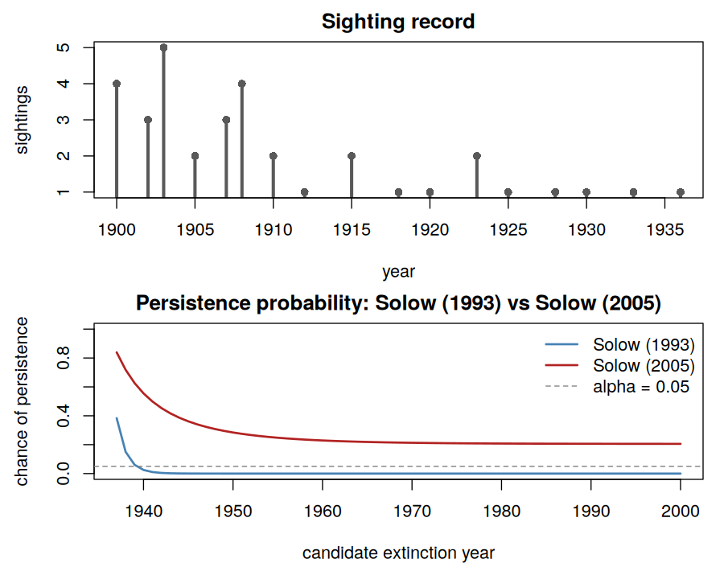

# EDE

[](https://CRAN.R-project.org/package=EDE) &nbsp; [](https://github.com/rodrigosqrt3/EDE/actions/workflows/R-CMD-check.yaml) &nbsp; [](https://codecov.io/gh/rodrigosqrt3/EDE)

Extinction date estimation from sighting records.

Given a time-ordered table of sighting counts, EDE estimates when a
species most likely went extinct, or tests whether it can still be
considered extant. Six estimators from the sighting-record literature are
implemented under one interface: an optimal linear estimator, two
likelihood-based persistence tests, a classical confidence interval, a
truncation-point extrapolation, and a combinatorial persistence test.

## Installation

```r
# install.packages("remotes")
remotes::install_github("rodrigosqrt3/EDE")
```

## Input

Every estimator takes a `sighting_data` object: a table with one row per
time unit and the number of sightings recorded in it.

```r
library(EDE)

years <- c(1900, 1902, 1903, 1905, 1907, 1908, 1910, 1912, 1915, 1918,
           1920, 1923, 1925, 1928, 1930, 1933, 1936)
sightings <- c(4, 3, 5, 2, 3, 4, 2, 1, 2, 1, 1, 2, 1, 1, 1, 1, 1)

sd <- sighting_data(data.frame(year = years, sightings = sightings))
```

The last confirmed sighting is 1936. No sightings were recorded afterward.

## Estimators

```r
ole(sd)
#> <OLE (Roberts & Solow 2003)>
#>   estimate: 1940.63
#>   95% CI: [1936.33, 1953.96]

robson1964(sd)
#> <Robson & Whitlock (1964)>
#>   estimate: 1993

strauss1989(sd)
#> <Strauss & Sadler (1989)>
#>   estimate: 1943.41

solow1993(sd, test_year = 2000)
#> <Solow (1993)>
#>   estimate: 1940

solow2005(sd, test_year = 2000)
#> <Solow (2005)>
#>   estimate: NA
#> Warning message:
#> chance of persistence never falls to alpha before `test_year`.

burgman1995(sd, test_year = 1945)
#> <Burgman, Grimson & Ferson (1995)>
#>   estimate: 1944
```

`solow1993()`, `solow2005()`, and `burgman1995()` test a grid of candidate
years up to `test_year` and return the first year at which the chance of
persistence drops to or below `alpha`. Pass `data_out = TRUE` to get the
full curve instead of the first crossing.

## Sighting record and persistence curves

```r
curve_1993 <- solow1993(sd, test_year = 2000, data_out = TRUE)
curve_2005 <- solow2005(sd, test_year = 2000, data_out = TRUE)

plot(curve_1993$time, curve_1993$chance, type = "l",
     xlab = "candidate extinction year", ylab = "chance of persistence")
lines(curve_2005$time, curve_2005$chance, col = "firebrick")
```



The two curves diverge because `solow2005()` weights the observation
window by cumulative sighting effort instead of raw elapsed time. Sightings
become sparse after 1912, so `solow2005()` treats the long silence after
1936 as less informative than `solow1993()` does, and never rejects
persistence within this window. This is expected behavior, not
disagreement between implementations: the two tests encode different null
models of the sighting process, and a sparse, irregular record is exactly
where they are expected to diverge.

## Methods

| Function | Reference | Output |
|---|---|---|
| `ole()` | Roberts & Solow (2003) | point estimate + CI |
| `robson1964()` | Robson & Whitlock (1964) | point estimate |
| `strauss1989()`, `strauss1989_curve()` | Strauss & Sadler (1989) | bound / curve |
| `solow1993()` | Solow (1993) | point estimate or curve |
| `solow2005()` | Solow (2005) | point estimate or curve |
| `mcinerny2006()` | McInerny, Roberts, Davy & Cribb (2006) | point estimate or curve |
| `burgman1995()` | Burgman, Grimson & Ferson (1995) | point estimate or curve |

See `vignette("EDE")` for the statistical background and a worked
comparison across all six methods.

## License

GPL (>= 3)
